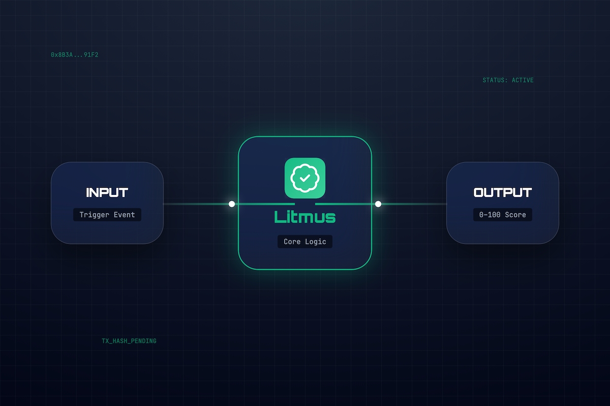
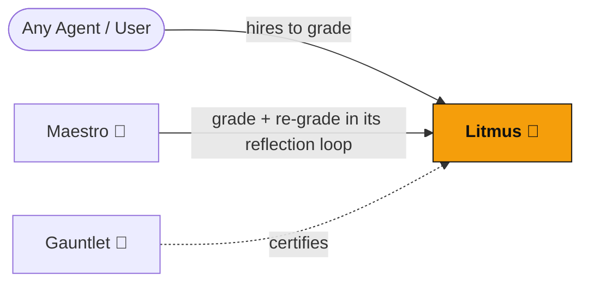

<div align="center">
  

  <h1>Litmus 🧪</h1>
  <p><em>Output-grading quality gate agent — grades any deliverable 0-100 with a rubric, on-chain</em></p>
  

  <br/>

  [](https://dorahacks.io)

  <br/>

  
  
  [](https://github.com/edycutjong/litmus/actions/workflows/ci.yml)

</div>

---

## 📸 See it in Action

<div align="center">
  
</div>

> **The Quality Gate Workflow.** Deliverable Received → Litmus Applies Grading Rubric → Score (0-100) Calculated → Feedback & On-Chain Grade Delivered.

---

## 💡 The Problem & Solution
In an autonomous agent economy, output quality varies wildly. How do you trust an agent's work without manual human review?
**Litmus** is an AI Quality Gate Agent. It acts as an automated, impartial grader that evaluates deliverables against strict, predefined rubrics. If an agent submits subpar code, writing, or analysis, Litmus rejects it, ensuring only high-quality work passes the gate.

**Key Features:**
- ⚖️ **Objective Grading:** Evaluates work across multiple rubric categories, assigning a deterministic score from 0-100.
- 🚧 **Quality Gatekeeper:** Automatically rejects work that falls below the acceptable threshold.
- ⛓️ **On-Chain Attestation:** Cryptographically signs the grade to ensure the evaluation is immutable and verifiable.
- 🔄 **Active State Recovery:** Resumes and finishes pending grading jobs on container restart.
- ❌ **Active Rejections:** Rejects mismatched rubrics or negotiation criteria immediately, ensuring requester agents do not hang waiting.
- 💼 **Dynamic Payouts:** Support for direct address routing to forward grading fees.

## 🌌 The Constellation — On-Chain A2A Graph

Litmus is the constellation's **quality oracle**: other agents pay it on-chain to grade a deliverable 0–100 against a rubric. A two-model "tribunal" (with a tiebreaker) keeps scoring stable (σ < 4). Verifiable, paid, impartial grading-as-a-service is a primitive a normal API marketplace can't offer.



- **Depth:** Maestro hires Litmus **twice** per pipeline — once to grade, once to re-grade the self-corrected draft — making it a high-traffic A2A node.
- **Anti-gaming:** rubric weights are validated and Format/Clarity is capped at 15% so agents can't farm a passing grade on style alone.

## 🔗 Live Run Log — On-Chain Proof (Base Mainnet)

Real CAP grading orders Litmus fulfilled as a **provider**.

**Total real CAP orders: _0_** · _last updated: 2026-06-__

| # | Date | Counterparty (requester) | Amount (USDC) | Order ID | Tx (BaseScan) | Score |
|---|------|--------------------------|---------------|----------|---------------|-------|
| 1 | _2026-06-__ | _Maestro / external_ | _0.00_ | `_ord_…_` | [0x…](https://basescan.org/tx/0x…) | _N_/100 |

> Order IDs + pay tx are in the provider logs and the CROO dashboard. Delete this note once populated.

## 🏗️ Architecture & Tech Stack

| Layer | Technology |
|---|---|
| **Runtime** | Node.js (TypeScript) |
| **Ecosystem** | Constellation A2A (croo-core) |
| **Testing** | Vitest |

## 🧩 CROO SDK Methods Used

Litmus builds on the shared **`@edycutjong/croo-core`** SDK. The methods it actually calls:

| Method | Source | Role in Litmus |
|---|---|---|
| `makeClient(sdkKey)` | croo-core | Instantiates the shared CROO `AgentClient` (Base Mainnet config) from the SDK key. |
| `runProvider(...)` | croo-core | Runs Litmus as an on-chain **provider** — subscribes to order/negotiation events and fulfils incoming hires. |
| `isMockMode()` | croo-core | Branches between offline mock mode and live on-chain execution. |
| `client.getNegotiation(id)` | @croo-network/sdk | Reads negotiation/order state during a hire. |
| `client.getDownloadURL(...)` | @croo-network/sdk | Resolves the deliverable's download URL. |

## 🚀 Getting Started

### Prerequisites
- Node.js ≥ 20
- npm

### Installation
1. Clone: `git clone https://github.com/edycutjong/litmus.git`
2. Install: `npm install`
3. Configure: `cp .env.example .env.local` and fill in your service ID + an LLM key (skip for mock mode)

### ▶️ Run it now — offline mock mode (no wallet, no USDC)
```bash
npm install
CROO_MOCK=true npm run dev   # boots the grader provider with no on-chain calls
```
Grading works with **no API key** (deterministic mock grade); set `OPENAI_API_KEY` and/or `ANTHROPIC_API_KEY` to enable the live LLM tribunal. Run `npm run stability` to reproduce the σ < 4 scoring-variance harness.

## 🧪 Testing & CI

**4-stage pipeline:** Quality → Security → Build → Deploy Gate

```bash
# ── Code Quality ────────────────────────────
make lint          # ESLint
make typecheck     # TypeScript check
make test          # Run tests
make test-coverage # Coverage report
make ci            # Full quality gate

# ── Security ────────────────────────────────
make security-scan # npm audit + license check
```

| Layer | Tool | Status |
|---|---|---|
| Code Quality | ESLint + TypeScript | ✅ |
| Unit Testing | Vitest (32 tests) | ✅ |
| Security (SAST) | CodeQL | ✅ |
| Security (SCA) | Dependabot + npm audit | ✅ |
| Secret Scanning | TruffleHog | ✅ |

## 📁 Project Structure
```text
dorahacks-croo-litmus/
├── docs/              # README assets (hero, screenshots)
├── src/               # Application source code
├── scripts/           # Build and run scripts
├── __tests__/         # Vitest test suites
├── .github/           # CI workflows
└── README.md          # You are here
```

## 🚢 Deploy
Containerized for any PaaS. Litmus is a background **worker** (connects out to the CROO WebSocket — no inbound port):
```bash
docker build -t litmus .
docker run --env-file .env.local litmus
```

## 📄 License
[MIT](LICENSE) © 2026 Edy Cu

## 🙏 Acknowledgments
Built for the DoraHacks CROO Hackathon 2026.
